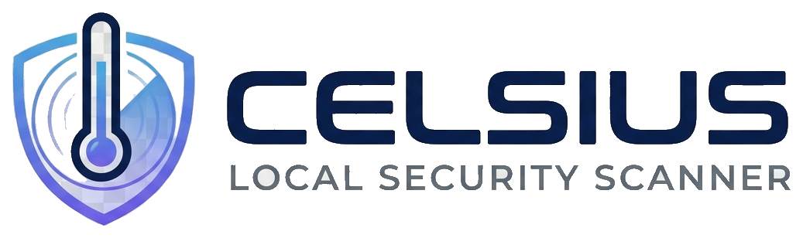
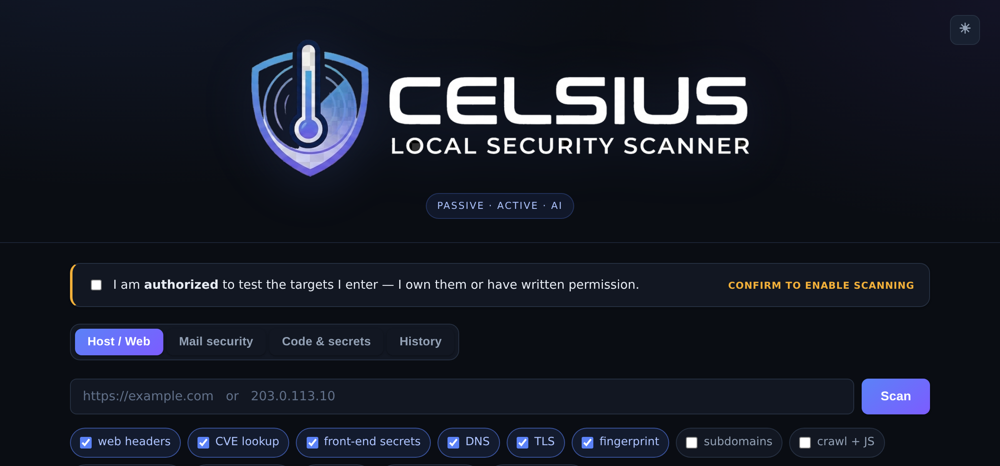
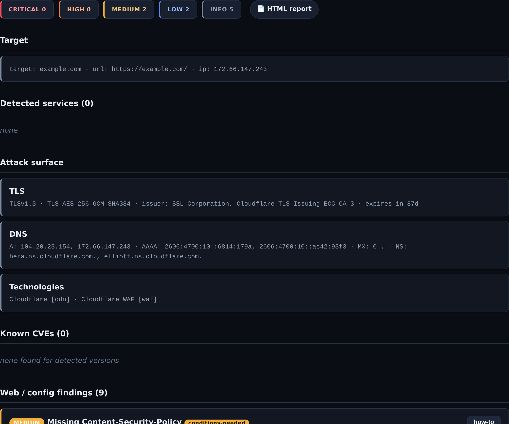
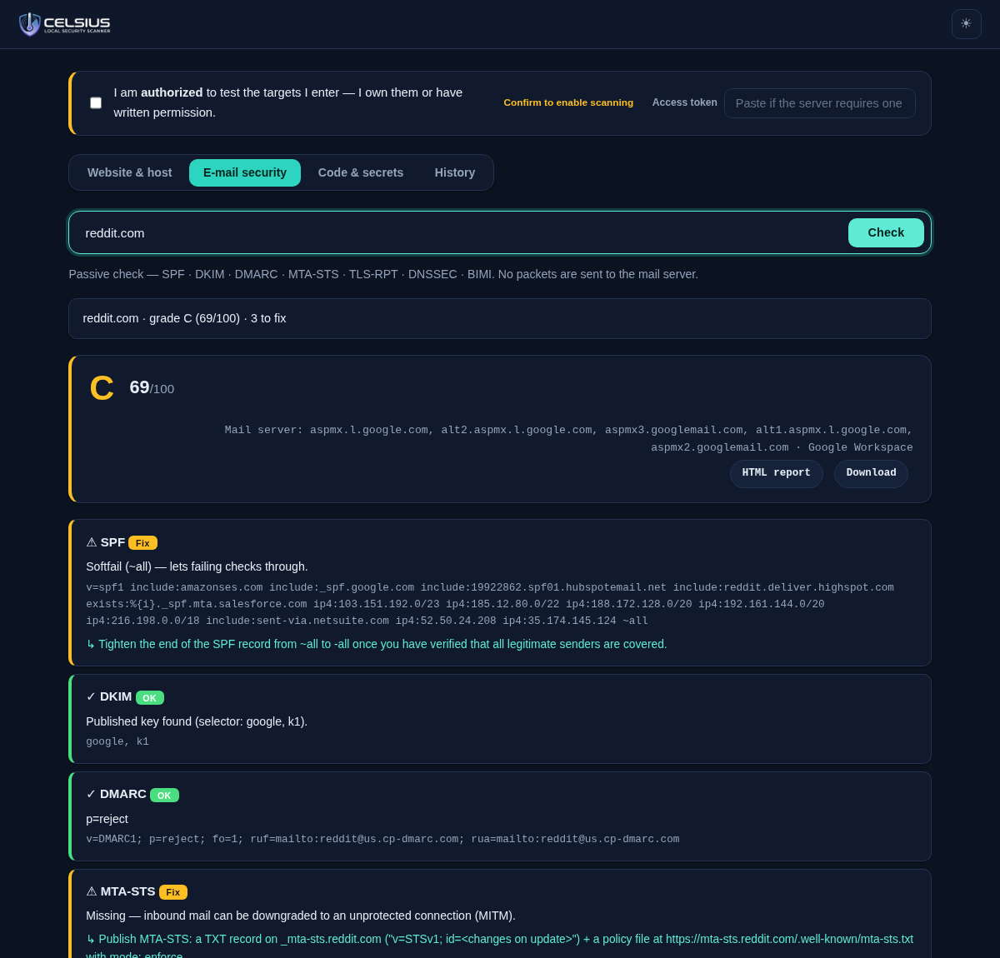

<div align="center">

<picture>
  <source media="(prefers-color-scheme: dark)" srcset="docs/logo-dark.png">
  
</picture>

### Local security scanner — web, network &amp; source code

<p>
  
  
  
  
  
</p>

Passive recon · OS/platform &amp; EOL fingerprinting · CVE + dependency (SCA) with
**public-PoC enrichment** · authenticated &amp; headless-browser scanning ·
CORS/JWT/takeover checks · email security · an **agentic AI proof loop** —
**one-command Docker deploy**, a polished web UI, and a stdlib-only core.

</div>

---

## Screenshots

<p align="center">
  
</p>
<table>
<tr>
  <td width="50%"><br><em>Host/web scan — services, attack surface, findings, one-click HTML report</em></td>
  <td width="50%"><br><em>Email security — SPF/DKIM/DMARC/MTA-STS graded A–F with exact fixes</em></td>
</tr>
</table>

---

**Celsius** is a lightweight vulnerability scanner for web pages, public IPs, **and
source code** — with a polished **web UI**, an **agentic AI proof loop**, and
**text-only proof-of-concept** generation. Its scanning core is **stdlib-only**
(the CLI needs no third-party packages); `nmap`/`nuclei` are optional,
auto-discovered binaries, and the web app adds only FastAPI/uvicorn.

**Contents:**
[Why Celsius](#why-celsius) · [What it does](#what-it-does) ·
[Run in Docker](#run-in-docker) · [Install](#install) · [Web app](#web-app) ·
[CLI usage](#cli-usage) · [AI layer](#ai-layer-m2) · [Governance](#governance-m0) ·
[Lab mode](#lab-mode-m5--active-verification) ·
[CVE matching](#how-cve-matching-works-and-why-its-not-just-one-api-call) ·
[Layout](#layout)

## Why Celsius

- 🐳 **Deploy in one command** — `docker compose up -d` brings up the web UI *and*
  working `nmap -O`/`-sS` (the process is root **inside** the container —
  namespaced, so no host-root service and no `sudo nmap` privilege hole).
- 🧱 **stdlib-only core** — the engine and CLI run on a bare Python install; there's
  zero third-party supply chain to vet for the part that touches your targets.
- 🔭 **Catches fresh CVEs others miss** — client-side **MITRE-CNA** semver matching
  flags just-published CVEs while NVD still says *"Awaiting Analysis"*, then links
  the confirmed ones to **public exploit PoCs** (trickest/cve).
- 🧪 **"No exploit, no report"** — an agentic AI loop confirms findings with benign,
  guard-railed probes before anything is labelled exploitable.

## What it does

**🗺️ Attack surface &amp; recon** — DNS (DoH), subdomain enum (crt.sh CT logs) +
optional DNS **brute-force tuned for self-hosted apps** (request/radarr/immich/…,
which sit under wildcard certs and are invisible to crt.sh),
TLS/certificate analysis, and tech/CDN/WAF/CMS fingerprinting, plus a **temporal
diff** of what changed since the last scan. Behind a CDN it runs **origin-exposure
discovery** — resolving subdomains + mail hosts and flagging any that point at a
non-CDN IP (the un-proxied origin you can then scan directly), plus an **origin
hunt**: ready-to-run Shodan/Censys pivots from the favicon hash + cert and, with a
`SHODAN_API_KEY`, an automatic candidate-IP lookup that's **confirmed by connecting
with the site's Host header** — surfacing the origin's real `Server` header the CDN
hid (a leak to firewall behind the CDN's ranges). It also flags **internal-address
exposure** — subdomains that resolve in *public* DNS to an RFC1918/private or
**Tailscale** (`100.64.0.0/10`) address, or a `*.ts.net` CNAME: an infrastructure
leak that reveals internal/VPN topology.

**🔌 Services, OS &amp; lifecycle** — service/version detection from headers + tech
fingerprints + optional `nmap -sV`; **passive OS/runtime inference**
(JSESSIONID→Java/Tomcat, ASP.NET→Windows/IIS, `Server`-header &amp; edge hints);
**active OS/device fingerprint** (`nmap -O`); and **end-of-life** flagging for
software that no longer gets security patches (PHP, IIS, Apache, Tomcat, OpenSSL…).

**🛡️ CVE &amp; dependency intelligence** — CVE lookup against **NVD + MITRE CNA** with
client-side version-range matching (catches freshly-published CVEs); **public
exploit-PoC enrichment** linking confirmed CVEs to working PoC repos
([trickest/cve](https://github.com/trickest/cve)); **dependency audit (SCA)** of
lockfiles/manifests (npm, PyPI, Packagist, RubyGems, Go, crates.io) via OSV.dev;
and **exploitability** scoring (EPSS + CISA **KEV** + reachability → verdict,
priority, and a "how to check" decision tree).

**🌐 Web security** — security-header audit (CSP, HSTS, X-Frame-Options, cookie
flags, version disclosure); deep **CSP content** analysis (unsafe-inline/eval,
wildcards, missing base-uri/frame-ancestors); **JWT** analysis (alg=none, weak
HMAC, no expiry); **CORS** misconfiguration; `security.txt`; dangling-CNAME
**subdomain takeover**; and an **email-security scorecard** (`--mail`) —
SPF/DKIM/DMARC/MTA-STS/TLS-RPT/DNSSEC/BIMI graded **A–F** with the exact DNS
record to add.

**🧭 Client-side &amp; crawl** — crawl + JS intel (API endpoints/routes, DOM-XSS
sinks), **source-map recovery** (reconstruct hidden original source → scan it for
secrets), OpenAPI/Swagger + GraphQL discovery, and optional **headless-browser
SPA analysis** (`--dynamic`, Playwright) that captures the XHR/fetch endpoints a
single-page app actually calls.

**🔑 Source code &amp; secrets** — front-end secret scan (HTML + linked JS) and a
static code scan (regex + Shannon entropy + SAST-lite), integrating
`gitleaks`/`semgrep`/`trufflehog` when present.

**🤖 AI layer** (`--ai`) — triage + attack-surface hypotheses, and an **agentic
proof loop** (plan → guard-railed send → judge) so only proven issues are
reported. Pluggable providers incl. **local Ollama** — nothing need leave the box.

**📤 Reporting &amp; integration** — exploit-chain **correlation** (findings → scored
attack paths), non-destructive **PoC/repro** steps per finding, optional
**nuclei** templates, and **terminal / JSON / HTML / SARIF / Markdown** output.
The exit code encodes the worst severity for CI gates.

## Run in Docker

The recommended way to run the web app — and the cleanest way to get **working OS
and port fingerprinting**. `nmap` requires `euid 0` for raw sockets (`-O`/`-sS`)
and does **not** honour file capabilities; a namespaced container root grants that
without a root-running host service or a passwordless `sudo nmap` (which is itself
a trivial privilege-escalation hole).

```bash
docker compose up -d --build     # build + start  →  http://localhost:8011
docker compose logs -f           # follow logs
docker compose down              # stop (data persists on the host)
```

The image bundles `nmap` + `nuclei` and publishes port **8011** (host) → 8000
(container) with just the `NET_RAW`/`NET_ADMIN` caps (no `--privileged`). Scan
history and caches bind-mount to `~/.local/share/celsius` and `~/.cache/celsius`
on the host, so they survive rebuilds. Edit `docker-compose.yml` to change the
port or pin one interface (e.g. `"192.168.1.102:8011:8000"`).

## Install

Managed with [uv](https://docs.astral.sh/uv/). The CLI is stdlib-only, so for a
quick run you don't even need to install anything:

```bash
# Run straight from a checkout — uv builds + caches it for you
uv run celsius https://example.com

# Or install the CLI as a tool on your PATH
uv tool install .                # then: celsius https://example.com

# Web app — the `web` extra (fastapi/uvicorn) + `dynamic` (Playwright for SPAs)
uv run --extra web --extra dynamic celsius serve   # http://127.0.0.1:8000

# Dynamic SPA analysis also needs the Chromium binary (one-time):
uv run --extra dynamic playwright install chromium
```

> A plain `uv run <cmd>` re-syncs to the base env and drops the extras, so always
> pass `--extra web --extra dynamic` for the server (or just use `./run.sh`).

No uv? The stdlib core still runs with plain Python — `python3 -m celsius
<target>` — and the web app works under a classic venv:
`python3 -m venv .venv && .venv/bin/pip install -e '.[web]'`.

## Web app

```bash
uv run --extra web --extra dynamic celsius serve   # http://127.0.0.1:8000
# convenience wrapper (detached, PID + logs): ./run.sh   (prefers uv, falls back to venv)
```

The UI has two tabs — **Host/Web scan** (target + options, live log, colour-coded
services/CVEs/findings, a *PoC steps* button on every item) and **Code & secret
scan** (server-side path or pasted snippet). An authorization checkbox gates all
host scanning; the API returns `403` without it. Advanced panels expose
**authenticated scanning** (attach a cookie/bearer/header or log in via a form) and
**lab mode** (active verification, behind an attestation) — so the web UI now
covers the same scanning surface as the CLI.

## ⚠️ Authorized use only

Scanning hosts you do not own or lack **written permission** to test may be
illegal (in Sweden e.g. under brottsbalken / dataintrångs provisions) and can
disrupt services. The tool requires an interactive confirmation; `--yes` asserts
you are authorized. Only point it at your own systems or sanctioned engagements
(pentest scope, bug-bounty in-scope, CTF, lab).

## CLI usage

> Examples below use `python3 -m celsius` (works with zero install). If you ran
> `uv tool install .`, just use `celsius …`; from a checkout, `uv run celsius …`.

```bash
# Host/web scan — headers + CVE lookup + front-end secrets (default)
python3 -m celsius https://example.com           # = `celsius scan https://example.com`

# Add nmap service scan, nuclei, and print PoC/reproduction steps
python3 -m celsius example.com --ports --nuclei --poc

# Specific ports, JSON + HTML output
python3 -m celsius 203.0.113.10 --ports --port-range 80,443,8080 \
    --json report.json --html report.html

# Non-interactive (e.g. CI) — asserts authorization
python3 -m celsius https://mysite.example --yes --json out.json

# Static code / secret scan of a repo (or a single file)
python3 -m celsius code /path/to/repo --json code-report.json

# Launch the web app
python3 -m celsius serve --host 127.0.0.1 --port 8000

# Authorize targets/modes with a scope file; disable active checks
python3 -m celsius scan example.com --scope scope.yml --no-active

# List past scans (stored locally in SQLite)
python3 -m celsius history

# Attack surface: DNS + TLS + fingerprint run by default; add subdomain enum
python3 -m celsius scan https://example.com --subdomains

# Crawl + JS analysis (endpoints, DOM sinks, source-map recovery) + API discovery
python3 -m celsius scan https://example.com --crawl --api-discovery

# AI analysis (DeepSeek by default) — triage + attack-surface hypotheses
export DEEPSEEK_API_KEY=sk-...
python3 -m celsius scan https://example.com --ai

# AI secure-code review (pluggable provider; offline 'mock' needs no key)
python3 -m celsius code /path/to/repo --ai --ai-provider deepseek
```

Subcommands: `scan <target>` (default), `code <path>`, `serve`, `history`.

### AI layer (M2)

`--ai` adds an LLM pass: **triage** (prioritize, flag likely false positives) and
**attack-surface hypotheses** (business-logic/chained issues signatures miss) on a
scan, or a **secure-code review** on `code`. Providers are pluggable —
`--ai-provider deepseek|openai|anthropic|local|mock` (keys via
`DEEPSEEK_API_KEY`/`OPENAI_API_KEY`/`ANTHROPIC_API_KEY`; `local` targets Ollama;
`mock` is offline for testing).

All AI output is labeled **`ai-hypothesis`** with a confidence and a
non-destructive verification step — proposals to confirm, never auto-verified
facts. Responses are cached and bounded by a token budget.

**Privacy:** secret redaction before sending to the model is **default ON** —
secrets are replaced with typed placeholders (`<AWS_KEY>`) so the model can still
reason about "a secret is here" without the value leaving the host. This covers
the active loop's **live response bodies and tool evidence**, not just the scan
summary — the copy sent to the model is masked while the raw response is kept
locally for the deterministic corroboration check and the operator-facing PoC.
Pass `--ai-no-redact` for maximum model visibility on a target you own; the local
report still carries full secret values for you to rotate. Every external send is
recorded in the audit log with `masked` (was masking applied) and
`sensitive_count`. Use `--ai-provider local` to keep everything on-machine.

#### Local / on-prem AI (Ollama) — nothing leaves the machine

celsius speaks the OpenAI-compatible API, so any local server works. With
[Ollama](https://ollama.com):

```bash
ollama pull llama3.1            # or qwen2.5, mistral, … (any model you have)
# Ollama auto-serves an OpenAI-compatible API at http://localhost:11434/v1

# CLI:
python3 -m celsius scan https://example.com --ai --ai-provider local --ai-model llama3.1
# non-default host/port:
python3 -m celsius scan ... --ai --ai-provider local --ai-base-url http://192.168.1.5:11434/v1
```

**In the web UI:** tick **AI analysis**, choose **Local (Ollama)** in the provider
dropdown, leave the API key blank, and (optionally) set the **model** and **base
URL** fields. Blank ⇒ defaults `llama3.1` at `http://localhost:11434/v1`. Then scan.

### Governance (M0)

Scans run as a **phase-ordered plugin pipeline** (recon → detect → enrich), are
**persisted** to a local SQLite store (browse via `history` or the web History
tab), and every active probe is written to an append-only **audit log**
(`~/.local/share/celsius/audit.log`). A `scope.yml` (see `scope.yml.example`)
authorizes which hosts may be scanned and in which **mode**:

- `passive` — ordinary HTTP + third-party lookups (NVD)
- `safe-active` — scanners/probes (nmap, nuclei), benign & non-destructive
- `exploit` — lab-mode active verification (opt-in, guardrailed; see Lab mode below)

Without a scope file, the default permits passive + safe-active for any target
you confirm; `exploit` always requires an explicit scope entry.

### Lab mode (M5) — active verification

`--lab` enables **non-destructive active verification**: it CONFIRMS or refutes
suspected vulnerabilities with benign payloads (a unique reflected-XSS marker, an
open-redirect canary, a read-only traversal canary, a single-quote SQLi error
probe, a **blind boolean-based SQLi** differential — an always-true vs always-false
condition, confirmed only when the true response tracks the baseline and the false
one diverges — and **server-side template injection**: a math expression in several
template syntaxes, confirmed only when the server returns the evaluated product but
not the raw expression, and **CRLF response-header injection**, confirmed only when a
uniquely-named injected header comes back in the response). Confirmed issues are
marked `confirmed-exploitable`.

**Out-of-band (OOB) probes** confirm *blind* bugs — ones that leave no trace in
the response — by planting a unique callback URL and watching a **self-hosted
canary** for the phone-home. A recorded hit is deterministic proof:
- **`--ssrf`** — blind **SSRF** (server fetches an injected URL → reachable
  internal services / cloud metadata),
- **`--rce`** — OS **command injection** (a shell payload makes the host `curl`
  the canary; benign — it only fetches your listener, nothing is destroyed),
- **`--blind-xss`** — blind/stored **XSS** beacon (injected markup loads the
  canary when rendered; confirms server-side-render/synchronous cases — victim-
  browser execution is asynchronous and won't fire during the scan),
- **`--xxe`** — blind **XXE** (an XML external entity in a POST body makes the
  server's XML parser fetch the canary; each endpoint is probed once with an XML
  body — endpoints that don't parse XML simply never call back).

The canary is self-hosted (no third-party collaborator), so the target must be
able to reach it: pass `--oob-host <addr>` with a LAN/public address the target
can route to (it auto-detects your LAN IP otherwise, and skips with a clear
message if a loopback callback can't reach a remote target). HTTP-callback based;
egress-filtered targets would need a DNS canary (not yet built).

**`--idor`** tests **broken object-level authorization** (IDOR / BOLA). It needs
a primary authenticated session (`--cookie`/`--bearer`/`--login-*`) — the test is
relative to what the logged-in user may access — and replays each object-
referencing request (a param named or valued like an id) as the primary user,
unauthenticated, and, with a second identity (`--auth2-cookie`/`--auth2-bearer`),
as that other user. It confirms deterministically when the unauthenticated replay
returns the protected object (**missing auth**), or a *second* user receives the
first user's object unchanged while the anonymous request is denied (**BOLA**).
Object-referencing requests only, so shared/public pages stay out.

It is gated by a layered safety harness — **all** must hold:
1. `--lab` flag set, **and**
2. a `--scope` file listing the target with `exploit` mode, **and**
3. a per-run attestation (`--lab-attest "..."` or the interactive prompt).

Plus: `--dry-run` previews every payload without sending it; a kill-switch file
`~/.celsius-stop` halts immediately; `--exploit-max-requests`/`--exploit-rate-limit`
bound the activity; and **every** active request is written to the audit log.

```bash
python3 -m celsius scan https://lab.local/ --lab --scope scope.yml \
    --lab-attest "I am authorized to actively test lab.local" --dry-run   # preview first
```

Lab mode is available from both the CLI and the **web UI** (an "⚠️ Lab mode" panel
gated behind the same attestation). The same layered safety harness applies in
either case; the destructive-by-default `exploit` mode still requires an explicit
scope/attestation.

#### Agentic AI proof loop (`--lab --ai`)

Add `--ai` to lab mode to run an **AI-driven prove-it loop**: the model reads the
live attack surface and *plans* high-signal, non-destructive probes (which
parameter, which benign payload, what would prove it); the **same lab harness**
sends each request under the guardrails above; then the model *judges* the real
response and only **proven** issues become `[AI-verified]` findings
(`confirmed-exploitable`). The model never sends a request itself, payloads are
validated read-only (no DROP/DELETE/OS-commands/time-based), and the request
cap/rate-limit/kill-switch/audit all still apply. This is celsius's take on
"no exploit, no report".

```bash
python3 -m celsius scan https://lab.local/?q=test --lab --ai --scope scope.yml \
    --lab-attest "I am authorized to actively test lab.local"
```

### Useful flags

| Flag | Meaning |
|------|---------|
| `--no-web` | skip HTTP header/CSP analysis |
| `--no-cve` | skip the NVD CVE lookup |
| `--no-cve-pocs` | skip public exploit-PoC enrichment (trickest/cve) |
| `--full` / `--thorough` | enable every safe check at once (ports, nuclei, subdomains, crawl, API discovery, mail, CVE-verify, OS detect) |
| `--cookie` / `--bearer` / `--header` | authenticated scan: attach a session/token to every request |
| `--login-url` (+ `--login-user`/`--login-pass`) | form login: log in first, then scan as that user |
| `--mail` | check email security (SPF/DKIM/DMARC/MTA-STS/TLS-RPT/DNSSEC/BIMI), graded A–F |
| `--ports` | run `nmap -sV` (off by default) |
| `--top-ports N` / `--port-range "80,443"` | port selection for nmap |
| `--nuclei` | run nuclei templates (if installed) |
| `--nvd-api-key KEY` | NVD API key (or `NVD_API_KEY` env) for higher rate limits |
| `--insecure` | skip TLS certificate verification |
| `--json FILE` / `--html FILE` | write reports |
| `-v, --verbose` | show per-step progress on stderr even when piped |
| `--debug` | verbose + debug detail (tool commands, nmap/nuclei stderr) |
| `--quiet` | only show errors on stderr |
| `--log-file PATH` | override the trace file (default `~/.local/share/celsius/scan.log`) |
| `-y, --yes` | skip the authorization prompt |

Exit code encodes the worst severity found (30 CRITICAL / 20 HIGH / 10 MEDIUM /
0 otherwise), handy in CI gates.

### Authenticated scanning

By default celsius scans as an anonymous, logged-out visitor. To reach surfaces
behind a login, attach a session — the crawler, secret scan, API discovery,
nuclei and active checks all run as that user:

```bash
# reuse a session you grabbed from the browser
celsius scan https://app.example.com --full --cookie "session=abc; csrf=xyz" -y
# or a bearer token
celsius scan https://api.example.com --bearer "$TOKEN" --crawl -y
# or let celsius log in via the form (CSRF hidden fields are auto-filled)
celsius scan https://app.example.com --full \
  --login-url https://app.example.com/login --login-user alice --login-pass secret -y
```

⚠️ An authenticated **active** scan sends requests as the logged-in user and can
change state (submit forms, etc.). Use a **test account / staging**. Every scan
that carries a session is recorded in the audit log.

### Logging

Every scan is always traced to a rotating log at
`~/.local/share/celsius/scan.log` (DEBUG level, independent of whether stderr is
a terminal) — so there is a durable record of what ran and what errored, including
the exact `nmap`/`nuclei` command lines and their stderr at `--debug`. The console
shows per-step progress on a TTY by default; `-v` forces it when piped, `--debug`
adds tool detail, `--quiet` limits it to errors. Scans launched from the web app
write to the same file. This is separate from the append-only **audit log**
(`~/.local/share/celsius/audit.log`), which records the accountability trail of
active probes.

## How CVE matching works (and why it's not just one API call)

Freshly published CVEs sit in NVD as *"Awaiting Analysis"* for days/weeks with
**no CPE configuration**, and their descriptions rarely name the exact affected
version. A naive `cpeName=`/keyword query therefore **misses the recent,
high-impact CVEs you care about most**. So celsius:

1. **Discovers** candidate CVEs for a product via one cached NVD keyword search.
2. **Version-matches each candidate client-side**:
   - against NVD's CPE version ranges when the CVE is *enriched*; otherwise
   - against the **MITRE CNA record's** structured `affected[].versions` semver
     ranges, available immediately on publication.
3. Filters CNA candidates by **product** (accept/reject regexes) so unrelated
   products the keyword search drags in (e.g. `ingress-nginx`, WordPress
   plugins) can't cause false positives.

Only authoritative sources (NVD + MITRE) are used — never search-engine results,
which are increasingly polluted with AI-invented "CVEs".

**Public-PoC enrichment.** Confirmed (firm-confidence) CVEs are then linked to
real, working proof-of-concept repositories from the community
[trickest/cve](https://github.com/trickest/cve) database — so a finding ships with
*"here's how it's exploited"* rather than just an identifier. Lookups are cached
and parallelised, and only firm matches are enriched (weak/AI matches are skipped
to avoid noise). Disable with `--no-cve-pocs`.

Under **lab mode** (`--lab --ai`) these PoC write-ups also **ground the AI's active
verification**: for each firm CVE the model reads the public exploit technique
(the trickest/cve repo README) and crafts ONE *benign* detection probe that tells a
vulnerable host from a patched one — never the raw destructive exploit — runs it
through the guard-railed lab harness, and judges the response. The verdict comes in
tiers: **confirmed** (a benign probe proved the vulnerable behaviour),
**reachable** (a non-destructive probe shows the vulnerable code path is active on
the host — strong corroboration without exploitation, the right answer for a
memory-corruption RCE you can't safely fire), **refuted** (patched/not present), or
a **manual-verification to-do** that hands you the exact target, version match and
public PoC so you can confirm it yourself. So a CVE becomes `confirmed-exploitable`
only when an actual probe, informed by the real technique, proves it on the target —
never on a version string alone.

> Worked example: nginx **1.29.6** is affected by **CVE-2026-42945** (range
> `0.6.27`–`<1.30.1`) but **not** CVE-2026-9256, whose real affected ranges
> (`0.1.17`–`0.9.7`, `1.30.0`–`1.30.1`, `1.31.0`) exclude 1.29.6 — even though
> some Google summaries claim otherwise.

## Requirements

- **Docker** (recommended for the web app + working OS detection) — everything
  else is bundled in the image; just `docker compose up -d --build`.
- Python 3.10+
- [uv](https://docs.astral.sh/uv/) (recommended) — `curl -LsSf https://astral.sh/uv/install.sh | sh`
- `nmap` (optional, for `--ports`/OS detect; OS detect needs root or a container)
- `nuclei` (optional, for `--nuclei`) — `go install github.com/projectdiscovery/nuclei/v3/cmd/nuclei@latest`

## Layout

```
celsius/
  cli.py            CLI + subcommands (scan/code/serve/history) + auth gate
  engine.py         plugin-pipeline orchestration (run_scan) + scope/audit/persist
  config.py         ScanConfig dataclass
  plugins/          plugin framework (base.py) + built-in checks (builtin.py)
  scope.py          scope.yml authorization gate (mode/exclusion gating)
  audit.py          append-only audit log
  store.py          SQLite persistence + scan history
  ai/               LLM layer: provider.py (DeepSeek/OpenAI/Anthropic/local/mock),
                    analyze.py (triage + code review), prompts.py, redact.py, cache.py
  exploitability.py exploitability assessment (EPSS + CISA KEV + verdict + how-to)
  correlate.py      exploit-chain correlation (composes findings into attack paths)
  completeness.py   completeness critic + blue-team detection-rule generation
  active/           lab-mode active verification: harness.py (safety chokepoint),
                    verifiers.py (XSS/redirect/traversal/SQLi, non-destructive)
  recon/            attack surface + client-side: dns.py (DoH), subdomains.py
                    (crt.sh), tls.py (cert/protocol), fingerprint.py (tech/WAF/CDN),
                    crawler.py, jsintel.py (endpoints/sinks), sourcemaps.py
                    (recover hidden source), apidisco.py (OpenAPI/GraphQL), dynamic.py
  targets.py        URL/host/IP parsing & resolution
  http_analysis.py  header fetch, service detection, security-header audit
  portscan.py       nmap -sV / -O wrapper (XML parsing, per-IP result cache)
  cve.py            NVD + MITRE CNA CVE lookup, version-range matching, trickest PoCs
  version.py        version comparison / range checks
  nuclei_scan.py    optional nuclei wrapper
  secrets.py        secret signatures (regex) + Shannon entropy
  codescan.py       static code scan (secrets + SAST-lite + ext. tools)
  websecrets.py     front-end secret scan (HTML + linked JS)
  poc.py            text-only PoC / reproduction generator
  report.py         terminal / JSON / HTML rendering
  models.py         dataclasses (Service, CVE, Finding, ScanResult)
  web/
    app.py          FastAPI backend (scan jobs, code, poc)
    static/         single-page UI (index.html, app.js, style.css)
```

## Limitations

- Banner/header versions can be spoofed or hidden (`server_tokens off`); absence
  of a version means no CVE lookup (kept conservative to avoid noise).
- `version.py` is a pragmatic numeric comparator, not full PEP 440 / semver.
- CVE coverage depends on the built-in product→CPE map; unknown products are
  reported as "verify manually".

## License

MIT — see [LICENSE](LICENSE). For authorized security testing only.
